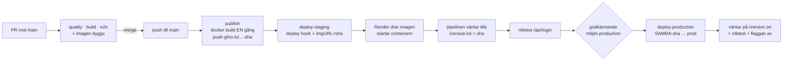

# Deploy – Kraftly Mina sidor

*Exempelifyllt facit (M4 + M5). Tider och URL:er är illustrativa – teamen fyller i sina egna.*

## Flödet



En merge till `main` är hela deployen. Ingen i teamet klickar i Render för att släppa en ny version.

## Miljöer

| Miljö | URL | Image | API | Uppdateras |
|---|---|---|---|---|
| Lokal | http://localhost:8080 | byggs lokalt (`docker compose up --build`) | mock-API i compose | när du vill |
| Staging | https://kraftly-volt-staging.onrender.com | `ghcr.io/team-volt/kraftly:<sha>` | Kraftlys test-API | varje merge till main |
| Produktion | https://kraftly-volt.onrender.com | **samma** `ghcr.io/team-volt/kraftly:<sha>` som staging | Kraftlys test-API (prod-nyckel) | efter godkännande i GitHub (Continuous Delivery) |

Vilken version kör staging? `curl https://kraftly-volt-staging.onrender.com/version.txt` – svaret är commitens sha.

## Konfiguration – var bor vad?

| Variabel | Hemlig? | Lokalt | Staging | Används av |
|---|---|---|---|---|
| `API_KEY` | **ja** | `.env` (egen dev-nyckel) | Render → Environment | nginx lägger på den som `X-Api-Key` |
| `API_URL` | nej | `.env` / compose: `http://api:4000` | Render → Environment | nginx `proxy_pass` |
| `PORT` | nej | 80 (från Dockerfile) | sätts av Render | nginx `listen` |
| `RENDER_DEPLOY_HOOK` | **ja** | – | GitHub → Environments → staging → Secrets | deploy-jobbet |
| `STAGING_URL` | nej | – | GitHub → Environments → staging → Variables | deploy-jobbet (verifiering) |
| `PROD_URL` | nej | – | GitHub → Environments → production → Variables | deploy-production (verifiering) |
| `RENDER_DEPLOY_HOOK` (prod) | **ja** | – | GitHub → Environments → production → Secrets – **eget värde**, samma namn | deploy-production |
| `APP_ENV` | nej | `public/config.js`: `lokal` | Render: `staging` / `production` | `40-runtime-config.sh` → `config.js` → miljöbannern |
| `FEATURE_NORWAY` | nej | `public/config.js`: `true` | Render: `true` i staging, `false` i prod | `40-runtime-config.sh` → `config.js` → `isEnabled('norway')` |
| `GITHUB_TOKEN` | ja | – | skapas av GitHub per körning | publish (push till GHCR) |
| `JWT_SECRET` | **ja** | `.env` (lokalt API) / compose | hos API:t (Kraftlys IT sätter den på test-API:t) – aldrig hos frontendtjänsten | API:t signerar och verifierar access tokens |
| `COOKIE_SECURE` | nej | `false` (http) | `true` hos API:t bakom https | refresh-cookien får flaggan `Secure` |

Ingenting i tabellen finns i repot. `.env` är gitignorerad och dockerignorerad, `.env.example` visar vilka variabler som finns.

## API v2 och autentiseringen (M6)

Appen anropar `/api/v2/…`. Nyckeln lägger nginx på som förut; **vem användaren är** bevisas med en access token (`Authorization: Bearer`) som API:t ger vid inloggning. Refresh-token kommer som en httpOnly-cookie från API:t, via nginx-proxyn, och hamnar därför på *vår* adress (`kraftly-volt-staging.onrender.com`) med `Path=/api/v2/auth` – browsern skickar den bara till auth-endpointsen, och bara till samma sajt. Inga cookies eller tokens passerar pipelinen eller Render-konfigurationen.

`/api/…` (v1) fungerar till **13 oktober 2026** (`Sunset`-headern) och används inte längre av appen. Röktesten i pipelinen postar fel uppgifter till `/api/v2/auth/login` och kräver 401 – det bevisar att v2 svarar genom proxyn – och kontrollerar att CSP-headern finns på `/`.

## API-nyckeln

- Den gamla nyckeln (`kraftly_live_sk_…`) låg i `src/services/api.js` och finns kvar i git-historiken. Den är **röjd för alltid** – alla som klonat eller forkat repot har den. Den är roterad: test-API:t accepterar den inte längre (`curl` nedan ger 401).
- Nyckeln finns inte längre i frontendkoden. En nyckel i JavaScript som skickas till browsern är publik, oavsett om den kommer från en fil, en `VITE_`-variabel eller en miljövariabel vid bygget.
- Den nya nyckeln ligger bara i Render och läggs på i nginx. Browsern ser den aldrig.

```
$ curl -s -o /dev/null -w "%{http_code}\n" -H "X-Api-Key: kraftly_live_sk_9f3a71bd42e88c015d6f" https://<test-api>/api/user
401
```

## Rollback

Det som körs är en image, och varje image i GHCR är taggad med sin sha. Rollback = be Render köra en äldre tagg. Två sätt:

1. **Hooken, samma som pipelinen (förstahandsvalet):** `curl -X POST "$RENDER_DEPLOY_HOOK&imgURL=ghcr.io%2Fteam-volt%2Fkraftly%3A<gammal-sha>"`
2. **Render:** tjänsten → *Events* → välj en tidigare lyckad deploy → *Rollback*. Fungerar exakt för deployer som pipelinen startat (de har en sha-tagg). **Inte** för den allra första deployen, som skapades med `:main` – Render hämtar då den *senaste* imagen med den taggen, alltså den nya versionen.

Sedan M5 finns `rollback.yml` med val av miljö: *Actions → Rollback → Run workflow → environment + sha*. Produktion kräver samma godkännande som en deploy.

**Genomförd rollback (Boiler Room 2, 25/9 2026, staging):**

```
Actions → Rollback → staging · sha 4c1f0b7e… (M4-taggen)
Be Render köra en äldre image
  Render har tagit emot ghcr.io/team-volt/kraftly:4c1f0b7e… (staging)
Vänta tills miljön kör den versionen
  Försök 1/30: staging kör 9e2d55a1… – väntar 10 s
  Försök 2/30: staging kör 9e2d55a1… – väntar 10 s
  ✅ https://kraftly-volt-staging.onrender.com kör 4c1f0b7e… igen
Klar på 1 min 52 s (11:38:04 → 11:39:56)
```

Skärmdump: `docs/img/rollback-2026-09-25.png`. Efteråt: `Run workflow` på CI/CD från `main` så att staging kör senaste sha:n igen. Norge-kortet försvann under rollbacken (koden fanns inte i M4) och kom tillbaka efteråt – flaggan i Render rördes inte.

Kontrollera efteråt med `/version.txt`. Obs: ändrar man en miljövariabel i Render efter en rollback deployas tjänstens grundimage (`:main`) igen – då är rollbacken borta. Nästa merge till `main` deployar som vanligt igen. En rollback är ett tillfälligt läge, inte en lösning – buggen ska fixas i koden.

## Tider (uppmätta, exempel)

| Steg | Tid |
|---|---|
| Merge → publish klar | ~2 min 40 s (quality/build/e2e + docker build + push) |
| Hook → staging kör nya sha:n | ~1 min 10 s |
| Totalt merge → live | ~4 min |
| Kallstart efter 15 min utan trafik | ~50 s för första anropet |

## Kända begränsningar

- Gratisnivån sover efter 15 minuter utan trafik. Första anropet efter det tar runt en minut. Acceptabelt för staging, inte för produktion.
- Render-kontot tillhör tech lead. Övriga i teamet behöver ingen åtkomst för att deploya – det sker via pipelinen – men loggarna syns bara för kontoägaren.
- Imagen byggs för `linux/amd64` på GitHubs runner. En image byggd på en Mac med Apple Silicon (`arm64`) och pushad för hand startar inte på Render. Pusha aldrig för hand.
- Produktion ligger också på gratisnivå och sover efter 15 minuter. För en riktig lansering: betald instans (ingen kallstart) – det är en rad i Render, inte en ändring i repot.
- Godkännandet i GitHub kan göras av vem som helst i teamet (required reviewers = alla fyra). *Prevent self-review* är på: den som mergade får inte godkänna sin egen deploy.
