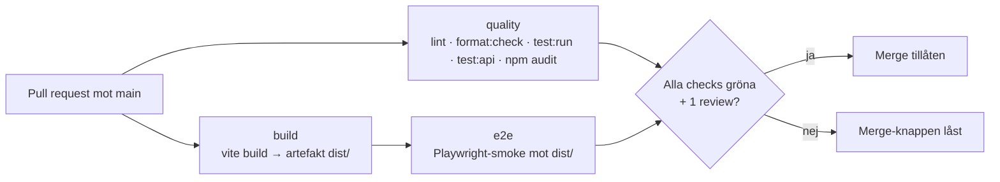

# Pipeline – Kraftly Mina sidor

*Exempel (lärarfacit). Teamens version ska innehålla deras egna mätvärden och beslut.*

## Flöde

`quality` och `build` kör parallellt. `e2e` väntar på `build` och testar den byggda artefakten – samma filer som senare deployas (M4).

## Vad som krävs för att merga

Branch protection på `main` (Settings → Rules → Rulesets):

- Pull request krävs, minst 1 godkännande
- Required status checks: `quality`, `build`, `e2e`
- Branchen måste vara uppdaterad mot `main` innan merge
- Gäller även administratörer

## Byggtid – före och efter npm-cache

| Steg | Utan cache | Med cache (`cache: npm`) |
|---|---|---|
| `npm ci` i quality | 38 s | 12 s |
| `npm ci` i build | 37 s | 11 s |
| Hela körningen (PR → alla gröna) | 3 min 40 s | 2 min 05 s |

*Exempelvärden – ersätt med era egna, avlästa i Actions → körningen → jobbet → stegets tid.*

Cachen nycklas på `package-lock.json`: ändras lockfilen byggs cachen om. Det är därför en inaktuell cache inte kan dölja ett beroendefel.

## Protokoll vid röd main

1. **Stoppa.** Ingen mergar något nytt förrän main är grön. Tech lead pingar i teamkanalen.
2. **Reproducera lokalt** med samma kommandon som pipelinen kör (de står i `ci.yml`).
3. **Laga framåt** om fixen är liten (< 30 min) – annars `git revert` av committen som gjorde main röd, felsök sedan i lugn och ro på en branch.
4. **Aldrig runt.** Inga avstängda checks, inga "merga så fixar vi sen".

## Beslut

- **E2E-verktyg:** Playwright – se `docs/decisions/e2e-verktyg.md`.
- **Parallellt eller i serie:** quality och build parallellt (snabbast feedback); e2e i serie efter build för att testa artefakten.
- **Cypress-binären** laddas inte ner i CI (`CYPRESS_INSTALL_BINARY=0`) – vi kör Playwright.

## npm audit (M6)

`quality` kör `npm audit --omit=dev --audit-level=high`. Hittar den något blir steget en **varning**, inte rött. Skälet: en sårbarhet i ett beroende ska synas i varje körning, men en ny CVE i ett transitivt paket en fredag ska inte stoppa en hotfix. Regeln: en varning som står kvar mer än en vecka blir ett ärende i backloggen. Vill vi blockera senare är det ett ord i ci.yml.
